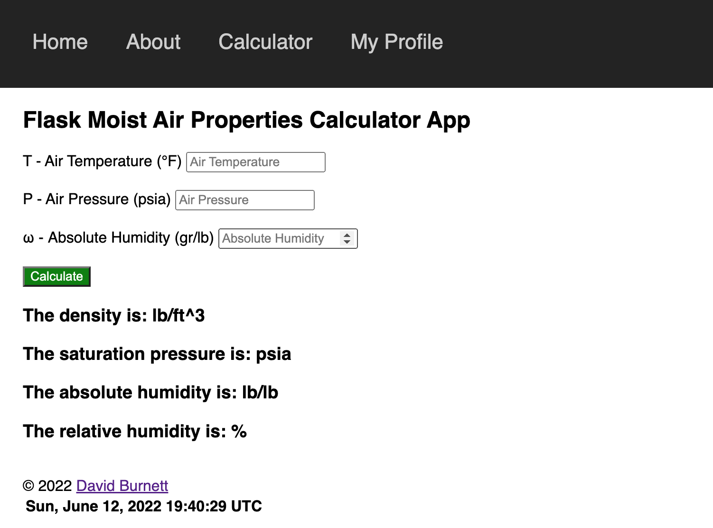

# Flask Air Properties Calculator

A simple calculator made with Flask.

## Demo

Here is a working live demo: 
http://flaskappairproprties-env.eba-xwjcdxam.us-east-1.elasticbeanstalk.com/calculate/

